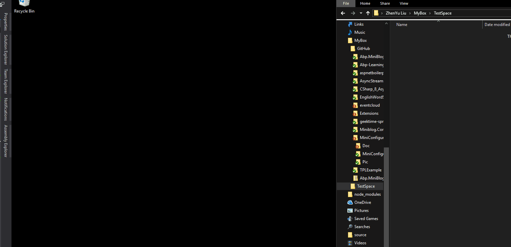
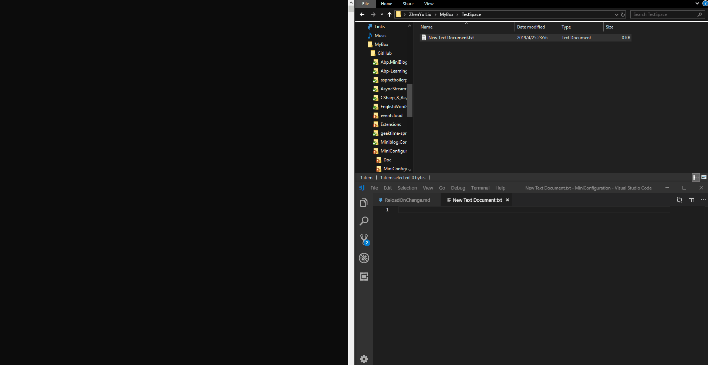

# 从蛇吃老鼠来聊聊 .Net Core中配置文件的ReloadOnChange

## Pre

很早在看 Jesse 的[Asp.net Core快速入门](http://video.jessetalk.cn/course/4)的课程的时候就了解到了在Asp .net core中,如果添加的Json配置被更改了,是支持自动重载配置的,作为一名有着严重"造轮子"情节的程序员,最近在折腾一个博客系统,也想造出一个这样能自动更新并Mysql中读取数据的ConfigureSource,所以点开了AddJsonFile这个拓展函数的源码,发现别有洞天,蛮有意思,本篇文章就简单地聊一聊Json config的ReloadOnChange是如何实现的,在学习ReloadOnChange的过程中,我们会把Configuration也顺带撩一把😁,希望对小伙伴们有所帮助.

``` c#
 public static IWebHostBuilder CreateWebHostBuilder(string[] args) =>
            WebHost.CreateDefaultBuilder(args)
                .ConfigureAppConfiguration(option =>
                    {
                        option.AddJsonFile("appsettings.json",optional:true,reloadOnChange:true);
                    })
                .UseStartup<Startup>();
```

如果你和我一样,对源码感兴趣,可以从官方的`aspnet/Extensions`中下载源码研究:https://github.com/aspnet/Extensions

这篇博客我们首先从它的源码简单看一下,看完你可能还是会有点懵的,别慌,后面我会对这些代码进行精简,做个简单的小例子,整个世界就会清晰了.

## 一窥源码

### AddJson

首先,我们当然是从这个我们耳熟能详的扩展函数开始,它经历的演变过程如下.

``` c#
    public static IConfigurationBuilder AddJsonFile(this IConfigurationBuilder builder,string path,bool optional,bool reloadOnChange)
    {
      return builder.AddJsonFile((IFileProvider) null, path, optional, reloadOnChange);
    }
```
传递一个null的FileProvider

``` c#
    public static IConfigurationBuilder AddJsonFile(this IConfigurationBuilder builder,IFileProvider provider,string path,bool optional,bool reloadOnChange)
    {
      return builder.AddJsonFile((Action<JsonConfigurationSource>) (s =>
      {
        s.FileProvider = provider;
        s.Path = path;
        s.Optional = optional;
        s.ReloadOnChange = reloadOnChange;
        s.ResolveFileProvider();
      }));
    }
```

把传入的参数演变成一个Action委托给`JsonConfigurationSource`的属性赋值.

``` c#
    public static IConfigurationBuilder AddJsonFile(this IConfigurationBuilder builder, Action<JsonConfigurationSource> configureSource)
    {
      return builder.Add<JsonConfigurationSource>(configureSource);
    }
```
最终调用的builder.add<T>(action)方法.

``` c#
    public static IConfigurationBuilder Add<TSource>(this IConfigurationBuilder builder,Action<TSource> configureSource)where TSource : IConfigurationSource, new()
    {
      TSource source = new TSource();
      if (configureSource != null)
        configureSource(source);
      return builder.Add((IConfigurationSource) source);
    }
```
在Add方法里,创建了一个Source实例,也就是JsonConfigurationSource实例,然后把这个实例传为刚刚的委托,这样一来,我们在最外面传入的`"appsettings.json",optional:true,reloadOnChange:true`参数就作用到这个示例上了.
最终,这个实例添加到builder中.那么builder又是什么?它能干什么?

敲黑板,Null的FileProvider很重要,后面要考😄.

### ConfigurationBuild

前面提及的builder默认情况下是`ConfigurationBuild`,我把这个ConfigureationBuilder进行了简化,关键代码如下.

``` c#
public class ConfigurationBuilder : IConfigurationBuilder
    {
        public IList<IConfigurationSource> Sources { get; } = new List<IConfigurationSource>();

        public IConfigurationBuilder Add(IConfigurationSource source)
        {
            Sources.Add(source);
            return this;
        }

        public IConfigurationRoot Build()
        {
            var providers = new List<IConfigurationProvider>();
            foreach (var source in Sources)
            {
                var provider = source.Build(this);
                providers.Add(provider);
            }
            return new ConfigurationRoot(providers);
        }
    }
```

可以看到,这个builder中有个集合类型的Sources,这个Sources可以保存任何实现了`IConfigurationSource`的Source,前面聊到的`JsonConfigurationSource`就是实现了这个接口,常用的还有`MemoryConfigurationSource`,`XmlConfigureSource`,`CommandLineConfigurationSource`等.

它还有一个很重要的build方法,这个build方法在`WebHostBuilder`方法执行`build`的时候也会执行,不要问我WebHostBuilder.builder方法什么执行的😂.

``` c#
public static void Main(string[] args)
        {
            CreateWebHostBuilder(args).Build().Run();
        }
```

在ConfigureBuilder的方法里面就调用了每个Source的Builder方法,我们刚刚传入的是一个`JsonConfigurationSource`,所以我们有必要看看它的builder做了什么.  
这里是不是被这些builder绕哭了? 小场面,我后面会整理一下,先别慌.

### JsonConfigurationSource

``` c#
    public class JsonConfigurationSource : FileConfigurationSource
    {
        public override IConfigurationProvider Build(IConfigurationBuilder builder)
        {
            EnsureDefaults(builder);
            return new JsonConfigurationProvider(this);
        }
    }
```

这就是`JsonConfigurationSource`的所有代码,未精简,它只实现了一个Build方法,可见build又多么重要.  
在Build内,EnsureDefaults被调用,可别小看,之前那个空的FileProvider在这里被赋值了.  

``` c#
        public void EnsureDefaults(IConfigurationBuilder builder)
        {
            FileProvider = FileProvider ?? builder.GetFileProvider();
        }
        public static IFileProvider GetFileProvider(this IConfigurationBuilder builder)
        {
            return new PhysicalFileProvider(AppContext.BaseDirectory ?? string.Empty);
        }
```

可以看到这个FileProvider默认情况下就是`PhysicalFileProvider`,为什么对这个FileProvider如此宠幸让我画如此大的伏笔要强调它呢?往下看.

### JsonConfigurationProvider && FileConfigurationProvider

在JsonConfigurationSource的build方法内,返回的是一个JsonConfigurationProvider实例,所以直觉告诉我,在它的构造函数内必有猫腻😕.  

``` c#
    public class JsonConfigurationProvider : FileConfigurationProvider
    {
       
        public JsonConfigurationProvider(JsonConfigurationSource source) : base(source) { }

      
        public override void Load(Stream stream)
        {
            try {
                Data = JsonConfigurationFileParser.Parse(stream);
            } catch (JsonReaderException e)
            {
                throw new FormatException(Resources.Error_JSONParseError, e);
            }
        }
    }
```

看不出什么的代码,事出反常必有妖~~  
看看base的构造函数.  

``` c#
        public FileConfigurationProvider(FileConfigurationSource source)
        {
            Source = source;

            if (Source.ReloadOnChange && Source.FileProvider != null)
            {
                _changeTokenRegistration = ChangeToken.OnChange(
                    () => Source.FileProvider.Watch(Source.Path),
                    () => {
                        Thread.Sleep(Source.ReloadDelay);
                        Load(reload: true);
                    });
            }
        }
```

真是个天才,问题就在这个构造函数里,它构造函数调用了一个`ChangeToken.OnChange`方法,这是实现ReloadOnChange的关键,如果你点到这里还没有关掉,恭喜,好戏开始了.  

## ReloadOnChange

Talk is cheap. Show me the code (屁话少说,放`码`过来).

``` c#
    public static class ChangeToken
    {
        public static ChangeTokenRegistration<Action> OnChange(Func<IChangeToken> changeTokenProducer, Action changeTokenConsumer)
        {
            return new ChangeTokenRegistration<Action>(changeTokenProducer, callback => callback(), changeTokenConsumer);
        }
    }
```

OnChange方法里,先不管什么func,action,就看看这两个参数的名称,producer,consumer,生产者,消费者,不知道看到这个关键词想到的是什么,反正我想到的是小学学习食物链时的🐍与🐀.  

那么我们来看看这里的🐍是什么,🐀又是什么,还得回到`FileConfigurationProvider`的构造函数.

可以看到生产者🐀是:

``` c#
() => Source.FileProvider.Watch(Source.Path)
```

消费者🐍是:

``` c#

() => {
    Thread.Sleep(Source.ReloadDelay);
    Load(reload: true);
}
```

我们想一下,一旦有一条🐀跑出来,就立马被🐍吃了,

那我们这里也一样,一旦有FileProvider.Watch返回了什么东西,就会发生Load()事件来重新加载数据.  

🐍与🐀好理解,可是代码就没那么好理解了,我们通过`OnChange`的第一个参数`Func<IChangeToken> changeTokenProducer`方法知道,这里的🐀,其实是`IChangeToken`.

### IChangeToken

``` c#
    public interface IChangeToken
    {
        bool HasChanged { get; }

        bool ActiveChangeCallbacks { get; }

        IDisposable RegisterChangeCallback(Action<object> callback, object state);
    }
```

IChangeToken的重点在于里面有个RegisterChangeCallback方法,🐍吃🐀的这件事,就发生在这回调方法里面.  
我们来做个🐍吃🐀的实验.  

## 实验1

``` c#
 static void Main()
        {
            //定义一个C:\Users\liuzh\MyBox\TestSpace目录的FileProvider
            var phyFileProvider = new PhysicalFileProvider("C:\\Users\\liuzh\\MyBox\\TestSpace");

            //让这个Provider开始监听这个目录下的所有文件
            var changeToken = phyFileProvider.Watch("*.*");

            //注册🐍吃🐀这件事到回调函数
            changeToken.RegisterChangeCallback(_=> { Console.WriteLine("老鼠被蛇吃"); }, new object());

            //添加一个文件到目录
            AddFileToPath();

            Console.ReadKey();

        }

        static void AddFileToPath()
        {
            Console.WriteLine("老鼠出洞了");
            File.Create("C:\\Users\\liuzh\\MyBox\\TestSpace\\老鼠出洞了.txt").Dispose();
        }
```

这是运行结果

可以看到,一旦在监听的目录下创建文件,立即触发了执行回调函数,但是如果我们继续手动地更改(复制)监听目录中的文件,回调函数就不再执行了.

这是因为changeToken监听到文件变更并触发回调函数后,这个changeToken的使命也就完成了,要想保持一直监听,那么我们就在在回调函数中重新获取token,并给新的token的回调函数注册通用的事件,这样就能保持一直监听下去了.
这也就是ChangeToken.Onchange所作的事情,我们看一下源码.

``` c#
   public static class ChangeToken
    {
        public static ChangeTokenRegistration<Action> OnChange(Func<IChangeToken> changeTokenProducer, Action changeTokenConsumer)
        {
            return new ChangeTokenRegistration<Action>(changeTokenProducer, callback => callback(), changeTokenConsumer);
        }
    }
    public class ChangeTokenRegistration<TAction>
    {
        private readonly Func<IChangeToken> _changeTokenProducer;
        private readonly Action<TAction> _changeTokenConsumer;
        private readonly TAction _state;

        public ChangeTokenRegistration(Func<IChangeToken> changeTokenProducer, Action<TAction> changeTokenConsumer, TAction state)
        {
            _changeTokenProducer = changeTokenProducer;
            _changeTokenConsumer = changeTokenConsumer;
            _state = state;

            var token = changeTokenProducer();

            RegisterChangeTokenCallback(token);
        }

        private void RegisterChangeTokenCallback(IChangeToken token)
        {
            token.RegisterChangeCallback(_ => OnChangeTokenFired(), this);
        }

        private void OnChangeTokenFired()
        {
            var token = _changeTokenProducer();

            try
            {
                _changeTokenConsumer(_state);
            }
            finally
            {
                // We always want to ensure the callback is registered
                RegisterChangeTokenCallback(token);
            }
        }
    }
```

简单来说,就是给token注册了一个`OnChangeTokenFired`的回调函数,仔细看看`OnChangeTokenFired`里做了什么,总体来说三步.

1. 获取一个新的token.
2. 调用消费者进行消费.
3. 给新获取的token再次注册一个`OnChangeTokenFired`的回调函数.

如此周而复始~~

### 实验2

既然知道了OnChange的工作方式,那么我们把实验1的代码修改一下.

``` c#
        static void Main()
        {
            var phyFileProvider = new PhysicalFileProvider("C:\\Users\\liuzh\\MyBox\\TestSpace");
            ChangeToken.OnChange(() => phyFileProvider.Watch("*.*"),
                () => { Console.WriteLine("老鼠被蛇吃"); });
            Console.ReadKey();
        }
```

执行效果看一下



可以看到,只要被监控的目录发生了文件变化,不管是新建文件,还是修改了文件内的内容,都会触发回调函数,其实JsonConfig中,这个回调函数就是Load(),它负责重新加载数据,可也就是为什么Asp .net core中如果把ReloadOnchang设置为true后,Json的配置一旦更新,配置就会自动重载.

##  PhysicalFilesWatcher

那么,为什么文件一旦变化,就会触发ChangeToken的回调函数呢? 其实`PhysicalFileProvider`中调用了`PhysicalFilesWatcher`对文件系统进行监视,观察PhysicalFilesWatcher的构造函数,可以看到`PhysicalFilesWatcher`需要传入`FileSystemWatcher`,`FileSystemWatcher`是`system.io`下的底层接类,在构造函数中给这个Watcher的Created,Changed,Renamed,Deleted注册EventHandler事件,最终,在这些EventHandler中会调用ChangToken的回调函数.

``` c#
    public PhysicalFilesWatcher(string root,FileSystemWatcher fileSystemWatcher,bool pollForChanges,ExclusionFilters filters)
    {
      this._root = root;
      this._fileWatcher = fileSystemWatcher;
      this._fileWatcher.IncludeSubdirectories = true;
      this._fileWatcher.Created += new FileSystemEventHandler(this.OnChanged);
      this._fileWatcher.Changed += new FileSystemEventHandler(this.OnChanged);
      this._fileWatcher.Renamed += new RenamedEventHandler(this.OnRenamed);
      this._fileWatcher.Deleted += new FileSystemEventHandler(this.OnChanged);
      this._fileWatcher.Error += new ErrorEventHandler(this.OnError);
      this.PollForChanges = pollForChanges;
      this._filters = filters;
      this.PollingChangeTokens = new ConcurrentDictionary<IPollingChangeToken, IPollingChangeToken>();
      this._timerFactory = (Func<Timer>) (() => NonCapturingTimer.Create(new TimerCallback(PhysicalFilesWatcher.RaiseChangeEvents), (object) this.PollingChangeTokens, TimeSpan.Zero, PhysicalFilesWatcher.DefaultPollingInterval));
    }
```

蒋金楠老师有一篇优秀的文章介绍`FileProvider`,有兴趣的可以看一下https://www.cnblogs.com/artech/p/net-core-file-provider-02.html.

最后,我么把用到的一些方法和类捋一捋.


